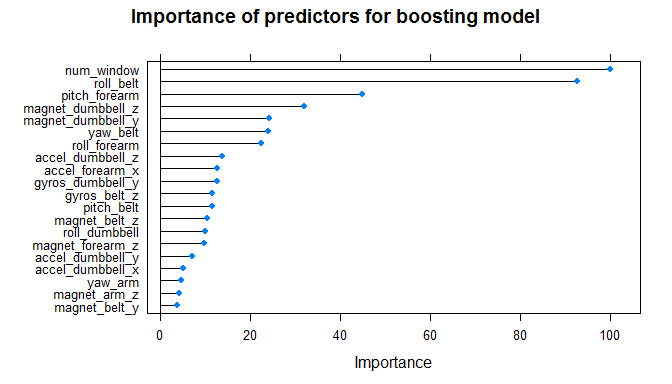
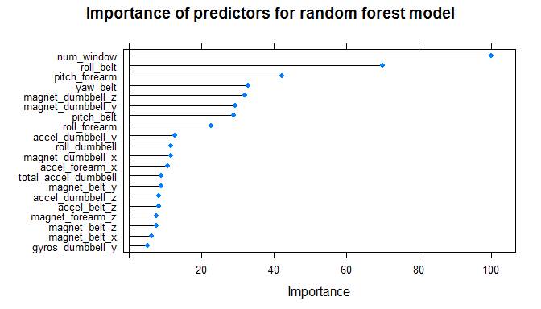

# Weight Lifting Exercise prediction
Jussi Kahtava  
12 November 2016  
===================================================================

## Summary

This report considers different machine learning prediction mechanisms for estimating whether the way of lifting weights can be predicted based on some kinetic data from body sensors. The data used for the analysis is from a data set of six participants who lifted weights in five ways (one correct, four in some ways incorrect). The source for this weighlifting data is [Human Activity Recognition](http://groupware.les.inf.puc-rio.br/har) by E. Velloso et.al. [@velloso2013]. The manner of exercise is the variable to be predicted - `classe`.The findings conclude that boosting and random forest perform well and predict nearly all the cases correctly in validation set, after the models were trained on training set. A combined model based on random forest and boosting is created with random forest method. This model also provides a very good prediction on the validation set after training in the testing set.

## Uploading and preparing data


```r
library(plyr)
library(caret)
library(caTools)
```


```r
fileUrl1 <- "https://d396qusza40orc.cloudfront.net/predmachlearn/pml-training.csv"
fileurl2 <- "https://d396qusza40orc.cloudfront.net/predmachlearn/pml-testing.csv"
download.file(fileUrl1, destfile = "./pml-training.csv")
download.file(fileurl2, destfile = "./pml-testing.csv")
pmltraining <- read.csv("./pml-training.csv")
pmltesting <- read.csv("./pml-testing.csv")
```
Some of the columns are not relevant for prediction. The parameter `X` is an index which we can remove. Also, the user names are not relevant since they do not represent information from the measured data. We also remove timestamps as not relevant predictors.

```r
pmltraining$X <- NULL
pmltesting$X <- NULL
pmltraining$user_name <- NULL
pmltesting$user_name <- NULL
pmltraining$raw_timestamp_part_1 <- NULL
pmltesting$raw_timestamp_part_1 <- NULL
pmltraining$raw_timestamp_part_2 <- NULL
pmltesting$raw_timestamp_part_2 <- NULL
pmltraining$cvtd_timestamp <- NULL
pmltesting$cvtd_timestamp <- NULL
```

## Preprocessing

The preprocessing stage removes columns with NAs in them since they have most of the observations missing. Measurements showing little variance across different observations are also removed. After that, validation partition is created for evaluating combined models. The remaining training set is split into training and testing sets for creating and evaluating individual prediction models.


```r
set.seed(2546)
nzv <- nearZeroVar(pmltraining)
filteredPmltraining <- pmltraining[, -nzv]
filteredPmltesting <- pmltesting[, -nzv]
tmp <- sapply(filteredPmltraining, anyNA)
filteredPmltraining <- filteredPmltraining[, !tmp]
filteredPmltesting <- filteredPmltesting[, !tmp]
inBuild <- createDataPartition(y=filteredPmltraining$classe,
                              p=0.7, list=FALSE)
validation <- filteredPmltraining[-inBuild,]
buildData <- filteredPmltraining[inBuild, ]
inTrain <- createDataPartition(y=buildData$classe,
                              p=0.7, list=FALSE)
training <- buildData[inTrain,]
testing <- buildData[-inTrain,]
```

## Selection and fitting of prediction models

We choose three models to fit to the weight lifting data. 

- Boosting ("gbm" in caret package)
- random forest ("rf" in caret package)
- linear discriminant analysis ("lda" in caret package)

The `caret` package provides tools for training each of these predictor models to fit in the training set of observations. Each model is processed with cross-validation eight times per model.


```r
set.seed(2016)
fitControl <- trainControl(## 10-fold CV
                          method = "cv",
                           number = 8,
                           ## repeated ten times
                           verboseIter = FALSE)
modFit_rf <- train(classe ~ ., data = training, method = "rf", trControl = fitControl)
predFit1 <- predict(modFit_rf, testing)
modFit_gbm <- train(classe ~ ., data = training, method = "gbm",trControl = fitControl)
predFit2 <- predict(modFit_gbm, testing)
modFit_lda <- train(classe ~ ., data = training, method = "lda",trControl = fitControl,
                    preProcess = c("center", "scale"))
predFit3 <- predict(modFit_lda, testing)
```


## Verifying out-of-sample performance for the trained models

All three models are used to predict the manner of weightlifting for the testing set that was set aside at the beginning. Below we show the confusion matrix and out of sample accuracy for each of the models examined.

### Linear discriminant analysis

```r
pred_lda <- predict(modFit_lda, testing)
confusionMatrix(pred_lda, testing$classe)[[2]]
```

```
##           Reference
## Prediction   A   B   C   D   E
##          A 952 118  69  48  31
##          B  37 520  65  29 113
##          C  79 108 485  71  67
##          D  97  17  74 500  73
##          E   6  34  25  27 473
```

```r
confusionMatrix(pred_lda, testing$classe)[[3]][1]
```

```
##  Accuracy 
## 0.7115104
```

### Random forest

```r
pred_rf <- predict(modFit_rf, testing)
confusionMatrix(pred_rf, testing$classe)[[2]]
```

```
##           Reference
## Prediction    A    B    C    D    E
##          A 1171    2    0    0    0
##          B    0  790    1    1    1
##          C    0    4  717    8    0
##          D    0    1    0  666    7
##          E    0    0    0    0  749
```

```r
confusionMatrix(pred_rf, testing$classe)[[3]][1]
```

```
##  Accuracy 
## 0.9939291
```

### Boosting

```r
pred_gbm <- predict(modFit_gbm, testing)
confusionMatrix(pred_gbm, testing$classe)[[2]]
```

```
##           Reference
## Prediction    A    B    C    D    E
##          A 1168    6    0    1    0
##          B    3  768    5    4    4
##          C    0   22  707   10    0
##          D    0    0    4  658    8
##          E    0    1    2    2  745
```

```r
confusionMatrix(pred_gbm, testing$classe)[[3]][1]
```

```
##  Accuracy 
## 0.9825158
```
We can see that the linear discriminant analysis model does not perform particularly well, whereas both boosting and random forest predict the test set really well. The accuracy for both boosting is 0.9825158 and for random forest 0.9939291 so they both predict the `classe` variable for the testing set more or less perfectly.

Plotting the importance of predictors for the boosting model shows that `num_window` and `roll_belt` are the predictors with largest influence on the model.

```r
varImpgbm <- varImp(modFit_gbm)
# Top 20 plot
plot(varImpgbm, main = "Importance of predictors for boosting model", top = 20)
```

<!-- -->

Plotting the importance of predictors for the random forest model shows that the importance of the top twenty predictors outside the top three is sligtly different from that of the boosting model.

```r
varImpgbm <- varImp(modFit_rf)
# Top 20 plot
plot(varImpgbm, main = "Importance of predictors for random forest model", top = 20)
```

<!-- -->

## Combined model

We also create a combined model which consists of boosting and linear discriminant analysis as predictors. These predictors together are used as a basis for building a model with random forest method.


```r
pred1 <- predict(modFit_lda, testing)
pred2 <- predict(modFit_gbm, testing)
predDF <- data.frame(pred1, pred2,classe=testing$classe)
combModFit <- train(classe ~.,method="rf",data=predDF)
combPred <- predict(combModFit,predDF)
```

Finally, we test the performance of the combined model on the validation set of observations.

```r
pred1V <- predict(modFit_lda,validation, message = FALSE) 
pred2V <- predict(modFit_gbm,validation, message = FALSE)
# combine lda and gbm predictors to a new model
predVDF <- data.frame(pred1=pred1V,pred2=pred2V)
combPredV <- predict(combModFit,predVDF)
confusionMatrix(combPredV, validation$classe)[[2]]
```

```
##           Reference
## Prediction    A    B    C    D    E
##          A 1670   17    0    0    0
##          B    4 1108   12    3    5
##          C    0   12 1007    8    1
##          D    0    2    6  952    5
##          E    0    0    1    1 1071
```

```r
confusionMatrix(combPredV, validation$classe)[[3]][1]
```

```
##  Accuracy 
## 0.9869159
```

```r
# predict on validation set with random forest model
pred3V <- predict(modFit_rf,validation, message = FALSE)
```
This model gives very good accuracy of 0.9869159 on the validation set. Applying one of the earlier single models, `rf`, on the same validation set gives accuracy of 0.9971113. In this case, the combined model, gives a bit worse performance than random forest model. The single model of boosting provides similar accuracy of 
0.9869159 as the combined model.

## Predicting the testing data

We run the prediction on the 20 test cases to produce the expected outcomes for those instances of training manners. For this purpose the random forest model is chosen as it provided the best out-of-sample accuracy on the validation set.

```r
pred_test <- predict(modFit_rf, filteredPmltesting)
pred_test
```

```
##  [1] B A B A A E D B A A B C B A E E A B B B
## Levels: A B C D E
```
## Conclusions

We predicted the manner of weightlifting from data provided by body sensors. It was shown that random forest and boosting gave a really good performance on out-of-sample estimates.

## References
